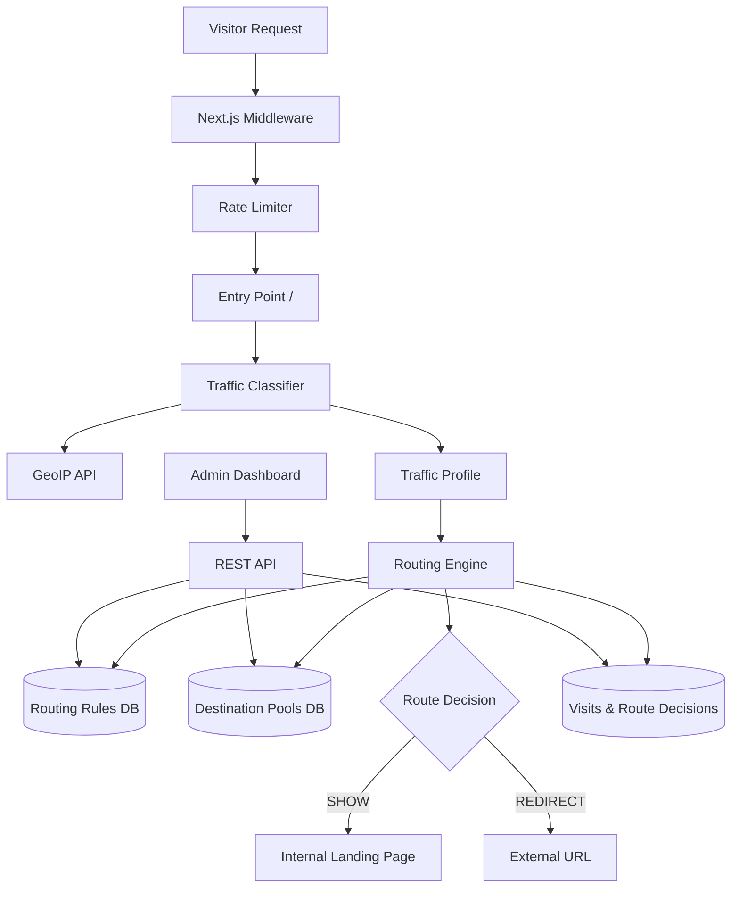

# Architecture

## System Overview



## Core Components

### 1. Traffic Classifier (`src/lib/traffic-classifier.ts`)

Analyzes incoming requests and builds a traffic profile:

- Parses User-Agent via `ua-parser-js`
- Detects device type (mobile/desktop/tablet)
- Identifies browser and OS
- Detects Facebook in-app browser (FBAN, FBAV, FBIOS patterns)
- Resolves country via IP geolocation API
- Extracts language from Accept-Language header

### 2. Routing Engine (`src/lib/routing-engine.ts`)

Evaluates admin-configured rules in priority order:

1. Match all conditions for a rule (AND logic)
2. If rule has a destination pool → weighted random selection
3. If rule has a direct destination → route to it
4. Fallback → default landing page

### 3. Random Destination Module

Weighted pool selection algorithm:

```
totalWeight = sum(member.weight)
random = Math.random() * totalWeight
iterate members subtracting weight until random <= 0
```

### 4. Analytics Pipeline

Every request creates:
- `Visit` record (device, geo, referrer, FB in-app flag)
- `RouteDecision` record (matched rule, destination, reason)

Conversions tracked separately via `/api/conversions`.

### 5. Admin Dashboard

Protected by middleware session check. Features:

- Rule builder with condition fields
- Destination & pool management
- Analytics dashboards
- Traffic log viewer
- Audit trail

## Database Schema

| Model | Purpose |
|---|---|
| `AdminUser` | Admin accounts |
| `Session` | JWT sessions with CSRF tokens |
| `Destination` | Internal landing pages or external URLs |
| `DestinationPool` | Named pools for weighted routing |
| `PoolMember` | Pool membership with weight |
| `RoutingRule` | Conditional routing rules |
| `RuleCondition` | Individual rule conditions |
| `Visit` | Traffic analytics records |
| `RouteDecision` | Per-visit routing outcome |
| `Conversion` | Conversion events |
| `AuditLog` | Admin action audit trail |

## Security Layers

1. **Middleware rate limiting** — per-IP limits on API routes
2. **Session auth** — HTTP-only JWT cookies
3. **CSRF tokens** — required on admin mutations
4. **Input validation** — Zod schemas on all API inputs
5. **Audit logging** — all admin CRUD operations logged

## Request Flow Example

```
1. User opens link in Facebook app
2. Classifier detects IS_FACEBOOK_INAPP = true
3. Rule "Facebook In-App → Primary Landing" matches (priority 10)
4. User sees /landing/primary
5. Visit + RouteDecision logged

1. User opens link in Chrome
2. Classifier detects IS_FACEBOOK_INAPP = false
3. Rule 10 doesn't match
4. Rule 100 (catch-all pool) matches
5. Weighted random → e.g. https://open.spotify.com
6. 302 redirect + analytics logged
```
